<h1 align="center">design-harness</h1>

<p align="center">
  
  
  
  
</p>

**Turn scattered reading and half-formed ideas into a design you can defend.**
The human adjudicates, the agent runs the errands.

An [Agent Skill](https://agentskills.io) (Claude Code plugin, works with any
SKILL.md-compatible agent) for evidence-based calls: vendor selection, literature
review, due diligence, competitive analysis — any contested decision that must stand
on traceable evidence.

[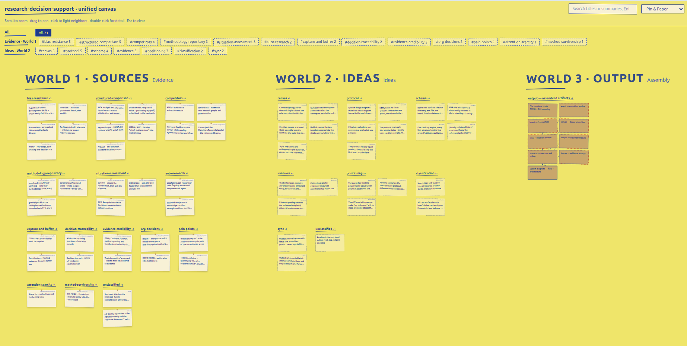](https://tigerless-labs.github.io/design-harness/)

<p align="center"><strong><a href="https://tigerless-labs.github.io/design-harness/">▶ Click the board to open the live canvas</a></strong> — this repo's own workspace, rebuilt on every merge.</p>

## What This Does

- **Sources file themselves** — drop papers, repos, blog posts; the agent files one
  card per source, grades it, and anchors every claim to where it came from.
- **Ideas are yours alone** — only a human creates an idea card; the agent links it
  to evidence, clusters neighbors, and surfaces conflicts instead of picking a side.
- **Output assembles on your word** — one command turns surviving ideas into the
  deliverable, and from then on ideas and output stay in permanent two-way sync.
- **Everything is traceable** — every design element links back through ideas to the
  sources that earned it, with an append-only log on every card.
- **Plain Markdown, no lock-in** — three folders in your repo; versionable,
  greppable, renders on GitHub. The agent is just the runtime.
- **One visual canvas** — a self-contained HTML projection of the whole board: no
  server, no dependencies, rebuilt on demand and thrown away.

## Installation

Claude Code:

```
/plugin marketplace add tigerless-labs/design-harness
/plugin install design-harness@design-harness
```

Codex (CLI and the ChatGPT desktop app share one plugin system):

```
codex plugin marketplace add tigerless-labs/design-harness
```

then install from `/plugins` in the CLI or the desktop app's plugin directory.

For other SKILL.md-compatible agents, copy the skill folder into your agent's skill
directory:

```bash
git clone https://github.com/tigerless-labs/design-harness
cp -r design-harness/plugins/design-harness/skills/design-harness \
  ~/.claude/skills/
```

## Usage

Talk to your agent in plain language:

```
> file these papers onto the board
```

```
> assemble the design
```

1. Drop material — the agent files and grades each source as a card.
2. Think out loud — your judgments land as idea cards, linked to their evidence.
3. Say go — the ideas assemble into the output your `target.md` declares.
4. Ask for the canvas — the agent builds the board and hands you a clickable link.

Render this repo's own workspace — the design of this very tool, dogfooded — in ten
seconds (it's the same board as the [live demo](https://tigerless-labs.github.io/design-harness/)):

```bash
python3 plugins/design-harness/skills/design-harness/scripts/build_canvas.py \
  docs/design-harness -o /tmp/canvas
open /tmp/canvas/canvas.html
```

## Canvas Styles

Five skins ship with the canvas; switch live from the toolbar, Pin & Paper is the
default. Screenshots below are this repo's own workspace, unretouched — the board
view and a close-up for each style.

### Pin & Paper (default)

<p>
  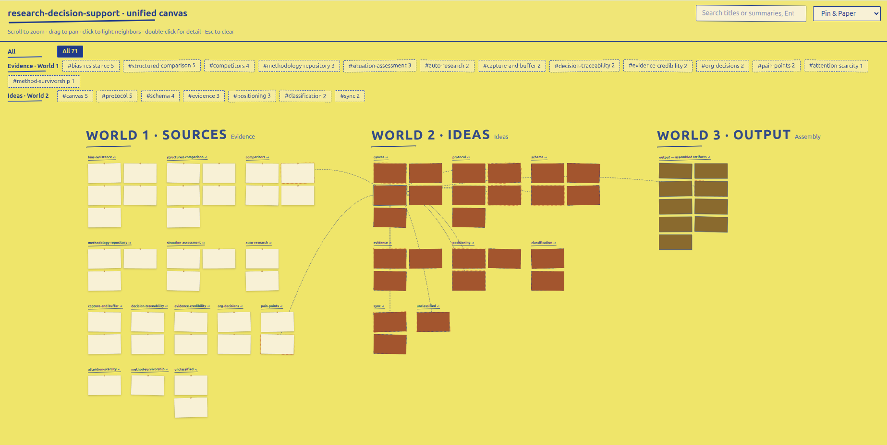
  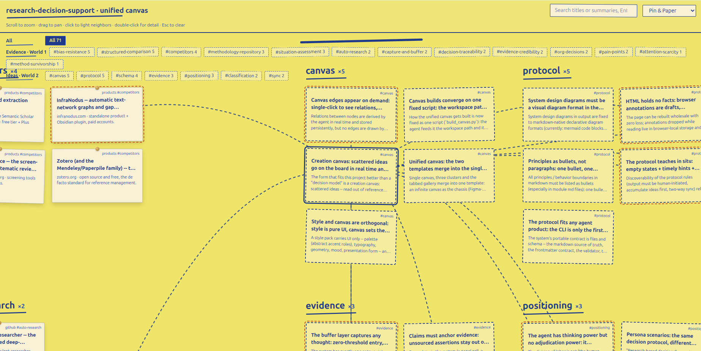
</p>

> A handmade pinboard: yellow paper ground, ink-blue hand script, pinned notes,
> taped slips, and dashed hand-drawn threads between them.

### Notebook Tabs

<p>
  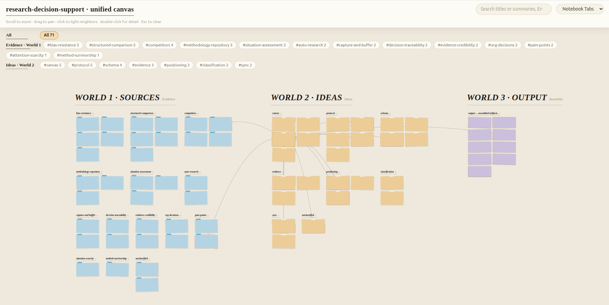
  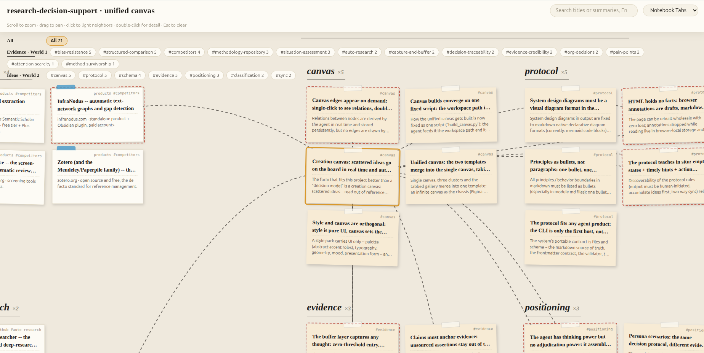
</p>

> Warm ivory stationery: serif italic headings, index cards with colored tab
> tongues, sticky-note ideas, stitched dashed connections.

### Swiss Modern

<p>
  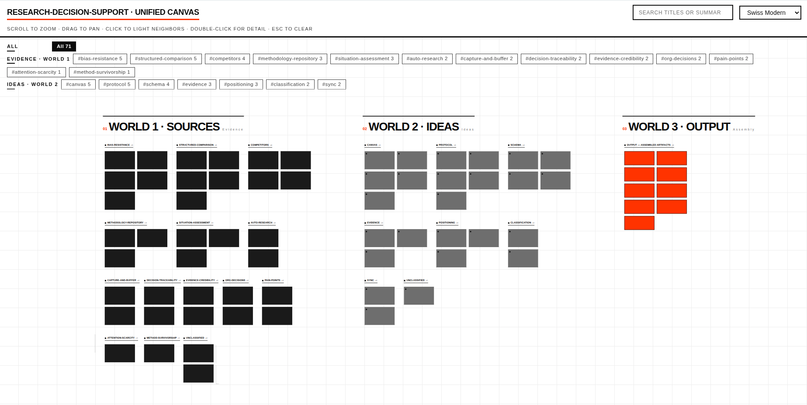
  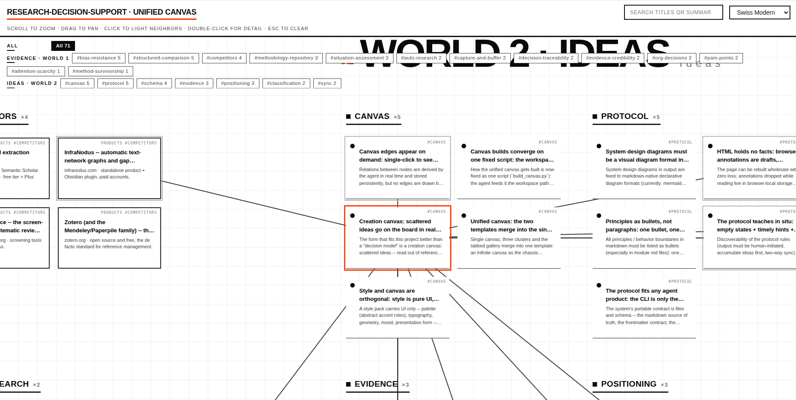
</p>

> White, ink, and one red accent: hairline grid, giant grotesk world titles with
> red ordinals, ruler-straight edges.

### BlockFrame

<p>
  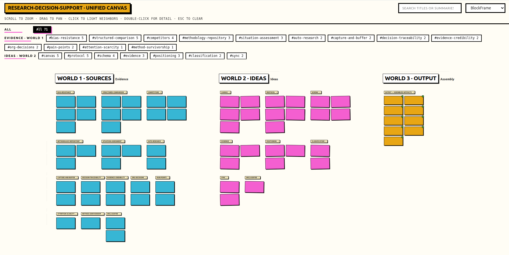
  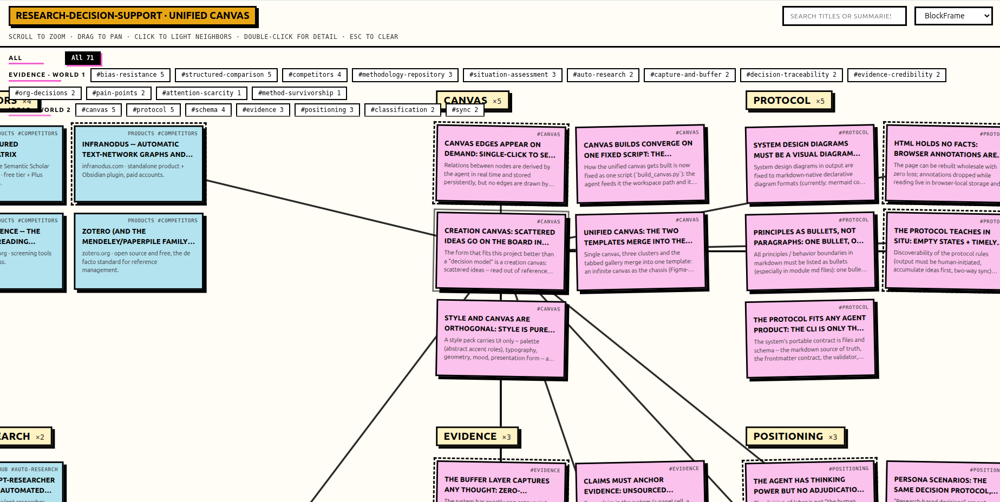
</p>

> Neo-brutalist pastel decks: thick borders, hard offset shadows, cyan / pink /
> yellow card blocks that tilt just enough to feel alive.

### 8-Bit Orbit

<p>
  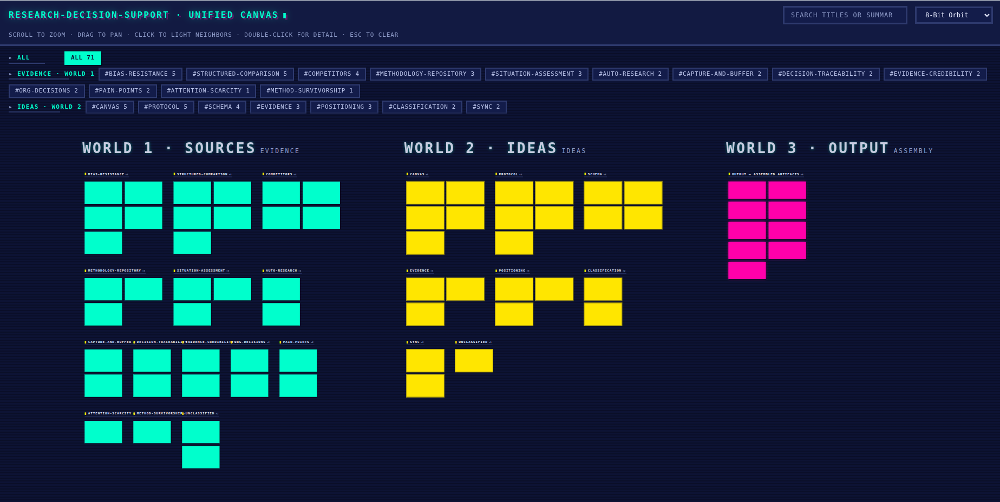
  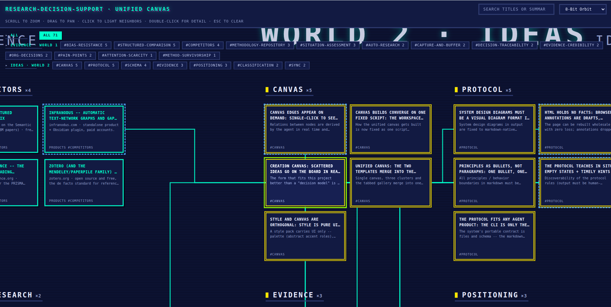
</p>

> A CRT arcade in deep navy — scanlines, neon cyan / yellow / magenta frames, and
> orthogonal circuit-trace edges. Dark in both color schemes; a CRT has no daylight
> mode.

## Philosophy

1. The human adjudicates, the agent runs the errands — agents execute well and judge
   poorly, and a wrong design costs the whole branch of code built on it.
2. Markdown is the only source of truth — every other surface, the canvas included,
   is a disposable projection.
3. Rejected ideas are archived with their reasons, never deleted — six months later,
   "why didn't we do X?" has an answer.
4. Every element of the output must answer "why?" with a link.

This repo is dogfooded on itself: its own design was produced by running the method
on ~80 sources about decision-making methods. The v1 workbench that taught us the
schema lives in [`archive/skill-v1/`](archive/skill-v1/).

## License

MIT — vendored renderers ([marked](https://github.com/markedjs/marked),
[DOMPurify](https://github.com/cure53/DOMPurify)) keep their original headers.
