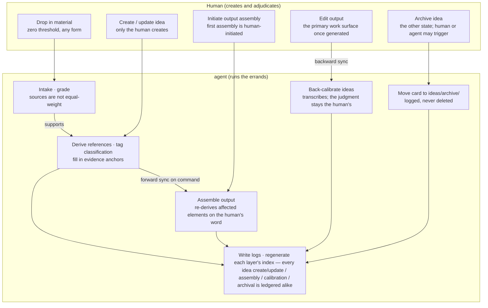
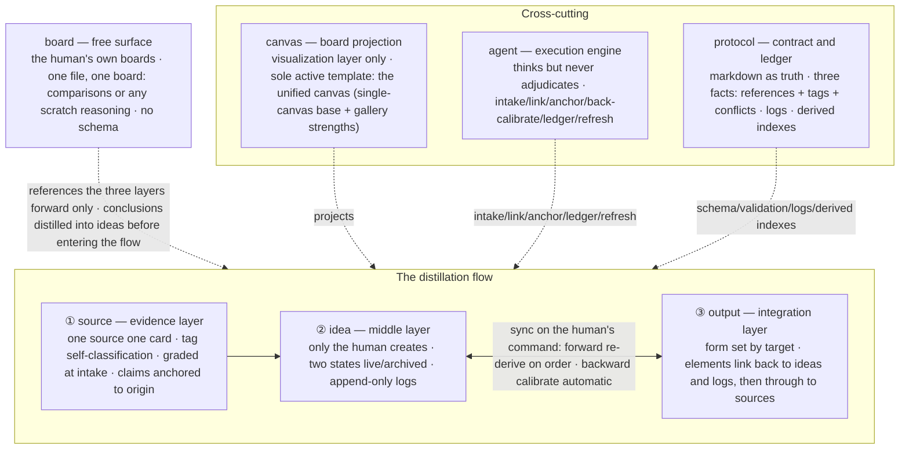

# System diagrams — flow + architecture

## System flow diagram

## System architecture diagram

Module details (one module, one doc): [source](modules/source.md) · [idea](modules/idea.md) ·
[output](modules/output.md) · [board](modules/board.md) · [canvas](modules/canvas.md) ·
[agent](modules/agent.md) · [protocol](modules/protocol.md).
