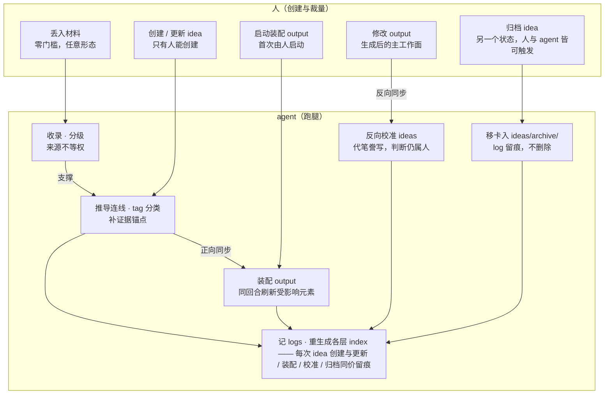
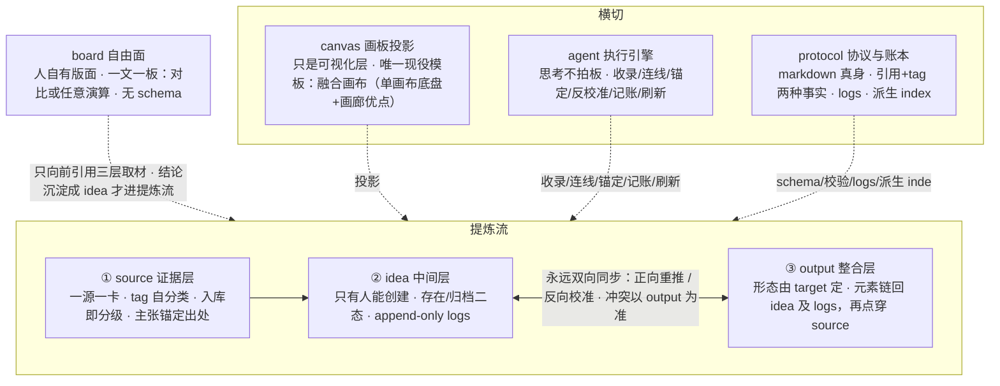

# 系统图 — 流程 + 架构

## 系统流程图

## 系统架构图

模块细节（一模块一文）：[source](modules/source.md) · [idea](modules/idea.md) ·
[output](modules/output.md) · [board](modules/board.md) · [canvas](modules/canvas.md) ·
[agent](modules/agent.md) · [protocol](modules/protocol.md)。
