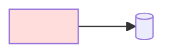

# Design: <name / version>

The design layer has two file kinds: **one spine** (this template: principles + pipeline +
global invariants + architecture diagram) and **one file per step/module** (its behavior
boundary + interface contract + acceptance criteria, reusing the element-registry provenance
format below). `index.md` is pointers only. Change rationale lives in the linked decision.

## Principle
<the pipeline's core claim, one sentence>

## Pipeline

## Global invariants
- <constraints that must hold across steps; stated once here, never restated per-step>

## Element registry (stable ID ↔ provenance)

- `A` <element-A> — implements [<idea>](../ideas/<idea-id>.md)
  (← [<source-id>](../sources/papers/<source-id>.md)); decided by
  [<decision>](../decisions/<decision-id>.md)
- `B` <element-B> — implements [<idea>](../ideas/<idea-id>.md)

Provenance: design element → ideas → source cards; any choice traces back to its sources.
