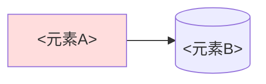

# 设计：<设计名/版本>

设计层两类文件：**脊柱一篇**（本模板：原则 + 流水线 + 全局不变量 + 架构图）与**每步/模块一篇**（本步的行为边界 + 接口契约 + 验收，复用下方「元素登记」provenance 格式）。`index.md` 只做指针。属于 ④ 装配，放入 `docs/research-loom/design/`；变更原因见对应决策。

## 原则
<这条 pipeline 的核心主张，一句话>

## 流水线

## 全局不变量
- <跨步都必须成立的约束；只在脊柱出现一次，per-step 文档不重述>

## 元素登记（稳定 ID ↔ provenance）

- `A` <元素A> — 实现 [<思路>](../ideas/<思路id>.md)（← [<源id>](../sources/papers/<源id>.md)）；决策见 [<决策>](../decisions/<决策id>.md)
- `B` <元素B> — 实现 [<思路>](../ideas/<思路id>.md)

provenance：设计元素 → ideas → 源卡，任何选择可追回论文。
